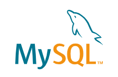
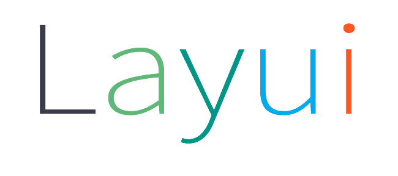

  
 

欢迎我的第位访客!

## 后端工程师 — 靠谱杨🙈

热爱后端、热爱技术。
为人谦逊、胆大心细。

:e-mail: : bitter_7@163.com

**VX** :

 

 

 

 

 

 

     

> CET4：545 / CET6：510
> 专业核心课程：算法与数据结构，数据库原理，软件工程概论，统一建模语言，软件需求与分析，软件构造，人机交互技术，软件设计，软件体系结构，软件测试技术，软件过程与管理，操作系统，计算机网络。

### 主页：

- <a href="https://www.cnblogs.com/rainbow-1/"><code></code></a>：发表 485 篇技术文章，11万阅读。数十篇随笔被推荐至网站首页，多篇随笔被各网站转载。 
- <a href="https://gitee.com/yang-chuanwei"><code></code></a> 

### 技术栈：

**Spring** <a href="https://spring.io/projects/spring-framework"><code></code></a> 
**Spring Web MVC** <a href="https://docs.spring.io/spring-framework/docs/current/reference/html/web.html"><code></code></a> 
**SpringBoot** <a href="https://spring.io/projects/spring-boot"><code></code></a> 
**Mybatis** <a href="https://mybatis.org/mybatis-3/"><code></code></a> 
**Mybatis-Plus** <a href="https://www.mybatis-plus.com/"><code></code></a> 

**Mysql** <a href="https://www.mysql.com/"><code></code></a> 
**Redis** <a href="https://redis.io/"><code></code></a> 
**Layui** <a href="https://www.layuiweb.com/index.htm"><code></code></a> 
**Flask** <a href="https://flask.net.cn/"><code></code></a> 
**Shiro** <a href="https://shiro.apache.org/"><code></code></a> 
**Tomcat** <a href="https://tomcat.apache.org/"><code></code></a> 
**Selenium** <a href="https://www.selenium.dev/"><code></code></a> 
**Hadoop** <a href="https://hadoop.apache.org/"><code></code></a> 
**Linux** <a href="https://www.linux.org/"><code></code></a> 

### 开源项目：

1. **基于知识图谱的科技政策管理系统**
    后端开发（Java、SpringBoot、自然语言分析处理）
    2021.10 - 至今
    参与老师的实际工程项目开发，现河北省科学技术情报研究院已投入使用。
    主要负责科技类政策录入以及政策相关属性的标引、关联关系分析模块的开发。
    提取科技类政策的主题词并依此建立了科技类政策知识图谱，确定科技类政策之间的关联关系。
    Gitee：https://gitee.com/yang-chuanwei/science3
2. **树懒电影网站（已以第一著作权人身份申请软件著作权）**
    承担后端技术开发工作（数据爬取、分析，数据库设计、逻辑设计）
    2021.03 - 2021.06
    1. 遇到爬取数据被限制的问题。通过采用反爬方式累计爬取共计3万余条电影数据。
    2. 遇到查询响应速度过慢的问题。通过采用优化表结构和索引，建立视图和缓存等方式，减少了系统的响应时间。
    3. 遇到用户查看电影不够便捷的问题。舍弃了分页式展示，采用了页面跟随鼠标下滑动态加载的形式。优化了页面交互性，提
        升了用户体验。
        GitHub: https://github.com/SAH01/MovieTop11
3. **疫情数据分析网站**
    全栈开发（Python、Flask、Echarts）
    2021.02 - 2021.05
    1. 实现了疫情数据的爬取并使用世界地图进行展示，完成了数据表格和世界地图的图表联动。
    2. 实现了我国省市二级地图下钻展示功能（单击省份，下钻到其对应市并展示数据）。
        GitHub : https://github.com/SAH01/myCov

 

### Github Stats

 

### Top Langs

 

### My Skill Set  

  
  
  
  
  
  
  
  
  
  
  
  
  
  
  
  
  
  
  
  

  

 

### Github Contribution

 

---

     

            

----

