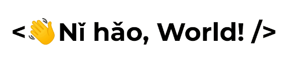

  

 

## 软件工程师（Java后端） — 靠谱杨🙈

热爱后端、热爱技术。
为人谦逊、胆大心细。

我的主页：[https://www.reliableyang.cn/](https://blog.51cto.com/reliableyang)

:e-mail: : bitter_7@163.com

**VX** : 

 

**我的公众号【靠谱杨阅读人生】**： 

 

> CET4：545 / CET6：510
> 专业核心课程：算法与数据结构，数据库原理，软件工程概论，统一建模语言，软件需求与分析，软件构造，人机交互技术，软件设计，软件体系结构，软件测试技术，软件过程与管理，操作系统，计算机网络。

### 主页：

- <a href="https://www.cnblogs.com/rainbow-1/"><code></code></a>：发表 500+篇技术文章，25万+阅读。数十篇随笔被推荐至网站首页，多篇随笔被各大其他技术网站转载。 
- <a href="https://gitee.com/yang-chuanwei"><code></code></a> 

### 技术栈：

**Spring** <a href="https://spring.io/projects/spring-framework"><code></code></a> 
**SpringBoot** <a href="https://spring.io/projects/spring-boot"><code></code></a> 
**Mybatis** <a href="https://mybatis.org/mybatis-3/"><code></code></a> 
**Mybatis-Plus** <a href="https://www.mybatis-plus.com/"><code></code></a> 

**Mysql** <a href="https://www.mysql.com/"><code></code></a> 
**Redis** <a href="https://redis.io/"><code></code></a> 
**Layui** <a href="https://www.layuiweb.com/index.htm"><code></code></a> 
**Flask** <a href="https://flask.net.cn/"><code></code></a> 
**Tomcat** <a href="https://tomcat.apache.org/"><code></code></a> 
**Selenium** <a href="https://www.selenium.dev/"><code></code></a> 
**Hadoop** <a href="https://hadoop.apache.org/"><code></code></a> 
**Linux** <a href="https://www.linux.org/"><code></code></a> 

### 项目经历：

1. **基于知识图谱的科技政策管理系统**

    **开发环境**：IDEA、JDK1.8、Git 
    **软件架构**：SpringBoot+Redis+Shiro+MySQL+Neo4j 
    **项目角色**：Java后端开发 
    **项目描述**：系统提供了完善的科技政策管理体系。通过参考现有的文本自动分类算法，使其能够完成科技政
    策的自动分类。提取科技政策的各种信息，完成多种条件相结合的检索方法。使用新词发现算法建立了科技
    政策的词典，同时配合文本分析算法，在一定程度上完成了科技政策之间的对比。采集大量科技政策建立有
    关科技政策的知识库，构成知识图谱，让政策与政策之间形成一定的关联。参考国务院发布的主题词表，确
    认了科技政策表达的主体内容。 
    **技术概述**：系统采用SpringBoot框架搭建，使用Shiro进行用户权限管理，实现单点登录，提高系统安全
    性。Redis统一缓存处理，提高系统性能和用户满意度，Hanlp文本处理并构建科技政策知识图谱网络图。该
    项目河北省科学技术情报研究院已投入使用。 
    **项目职责**： 

    1. 参与需求分析和系统设计的讨论工作，协助完成相关开发辅助文档。

    2. 独立完成项目政策信息录入、政策主体标引管理模块的后台接口。

    3. 负责部分分词统计和构建知识图谱的工作。

    4. 负责项目上线部署调试和维护的工作。

        **Github**：https://github.com/SAH01/science_technology_policy_integration_service

          

2. **树懒电影网站（软件著作权登记号2022SR0574174）**
    承担后端技术开发工作（数据爬取、分析，数据库设计、逻辑设计） 
    2021.03 - 2021.06 

    1. 遇到爬取数据被限制的问题。通过采用反爬方式累计爬取共计3万余条电影数据。

    2. 遇到查询响应速度过慢的问题。通过采用优化表结构和索引，建立视图和缓存等方式，减少了系统的响应时间。

    3. 遇到用户查看电影不够便捷的问题。舍弃了分页式展示，采用了页面跟随鼠标下滑动态加载的形式。优化了页面交互性，提
        升了用户体验。 
        **GitHub**: https://github.com/SAH01/MovieTop11

         

3. **疫情数据分析网站** 
    全栈开发（Python、Flask、Echarts） 
    2021.02 - 2021.05 

    1. 实现了疫情数据的爬取并使用世界地图进行展示，完成了数据表格和世界地图的图表联动。

    2. 实现了我国省市二级地图下钻展示功能（单击省份，下钻到其对应市并展示数据）。 

        **GitHub** : https://github.com/SAH01/myCov

         

4. **个人博客系统**

    **开发环境**：IDEA、JDK1.8、Git 
    **软件架构**：SpringBoot + Redis + Spring Security + MySQL+ Vue 
    **项目角色**：Java后端开发 
    **项目描述**：项目主要提供包含但不限于写文章、标签管理、分类管理、最新最热文章、评论和归档等一系列
    功能模块，基本可以满足一个个人博客的使用需求。 
    **技术概述**：jwt + redis 使用token令牌登录，ThreadLocal本地保存用户信息并做了线程安全处理，文章加
    载和阅读数更新做了线程隔离处理，Spring Security权限管理系统，统一日志记录、统一缓存处理、统一异
    常拦截、统一登录拦截，分布式ID（UUID）。 
    **项目职责**：负责全部的后端开发工作和部分前端工作。 
    **GitHub**：https://github.com/SAH01/blog-yang

5. **科技查新数据分析系统**

    **开发环境**：JDK1.8 
    **软件架构**：SpringBoot + Redis + Vue + MySQL + Vue + Neo4j 
    **项目角色**：全栈开发 
    **项目描述**：科技查新数据分析系统针对科技报告和文献等数据进行处理和分析。对数据中的关键字段如科学技术要点、项目来源（地域）、项目隶属单位、项目年份、所属学科分类等展开研究。采用TF-IDF算法从科学技术要点中提取出项目的关键词信息，之后采用TextCNN文本分类模型进而完成对文献的学科领域归类。从中抽取单位、学科领域、项目、地域四个实体，选取Neo4j数据库完成科技文献知识图谱的构建工作。用户可以根据自己的需求输入一段查新要点，系统会自动完成关键词的提取以及归类。 
    **技术概述**：前端：Vue、Axios、Echarts、Element UI 后端：SpringBoot、Redis、MySQL、Neo4j 技术：TF-IDF、Word2Vec词向量、TextCNN文本分类、知识图谱 
    **GitHub**：[https://github.com/SAH01/blog-yang](https://github.com/SAH01/technology_novelty_search_data_analysis_system)

### Github Stats

 

### Top Langs

 

### My Skill Set  

  
  
  
  
  
  
  
  
  
  
  
  
  
  
  
  
  
  
  
  

  

 

### Github Contribution

 

---

     

            

----
